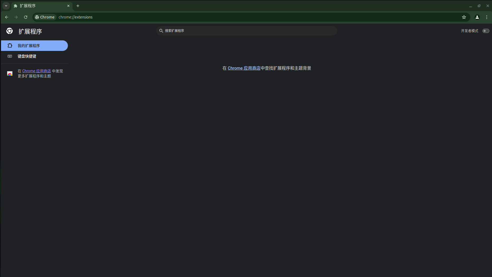
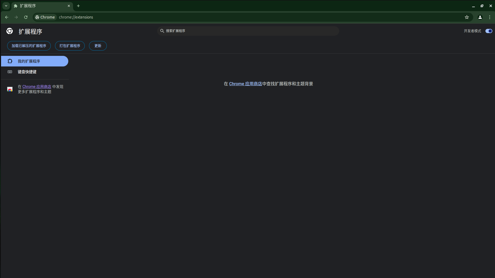

# 如何安装

## 安装实时版本

1. 通过以下命令 Clone 此仓库到本地。

```
git clone https://github.com/Zeeker-Dev-Team/antiTrackElements.git
```

2. 进入 Chrome 扩展程序管理界面。

   在 Chrome 浏览器中打开以下 URL：

```
chrome://extensions/
```

你应该看到如下页面：


3. 打开开发者模式

   在右上角的 `开发者模式` 选项，打开它（如果已经打开，请忽略）。

打开后应该呈类似如下界面：


4. 导入扩展

   点击左上角 `加载已解压的扩展程序` 按钮，在选择文件夹窗口，选择你刚刚 Clone 的此仓库。

5. 完成。

## 安装稳定版本

1. 通过访问下方链接去到此仓库的发布页面。

```
https://github.com/Zeeker-Dev-Team/antiTrackElements/releases
```

2. 找到最新的标题包含 Stable 的版本。

3. 下载附带的 `antiTrackElements.crx`

4. 在 Google Chrome 中安装此扩展程序。

5. 完成。